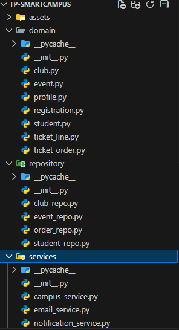
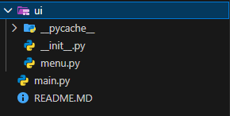
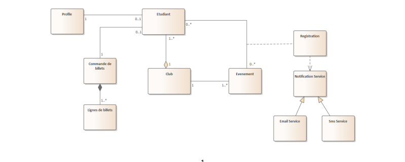
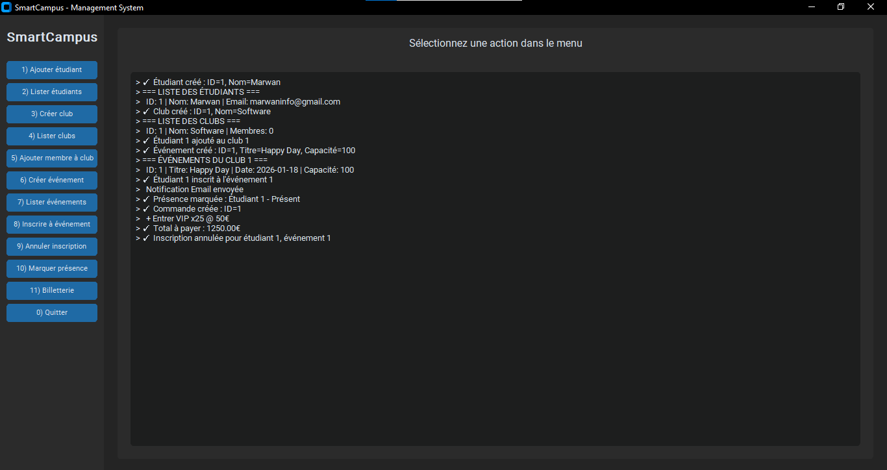
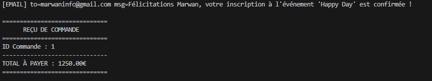

🎓 SmartCampus Management System

SmartCampus est un système de gestion modulaire développé en Python. Ce projet constitue le projet de fin de module pour la formation en Programmation Orientée Objet (POO) du programme JobInTech (YNOV CAMPUS).

L'objectif principal n'était pas seulement de créer des fonctionnalités, mais de mettre en œuvre une architecture robuste, maintenable et évolutive en suivant les meilleures pratiques de l'industrie logicielle.

📐 Architecture & Organisation

Le projet suit strictement un modèle d'Architecture en Couches (Layered Architecture) afin de séparer les responsabilités et de faciliter la maintenance.

Structure du Projet

La base de code est organisée en trois couches distinctes : Domain (entités métier), Services (logique métier & orchestration), et UI (présentation utilisateur).

📂 Structure des Dossiers

📊 Diagramme de Classes UML

Séparation claire des responsabilités

Relations entre entités et héritage

🖥️ Interface Utilisateur (GUI)

Le projet propose une interface graphique moderne construite avec CustomTkinter, démontrant l'intégration fluide de services backend avec un frontend desktop.

Capture d'écran du Test

<em>Aperçu du tableau de bord SmartCampus lors d'un scénario de test.</em>

Capture de console pour l'email

<em>Aperçu du console email notification.</em>

🚀 Points Techniques Clés

Ce projet démontre l'application de concepts avancés de la POO :

✅ Architecture en Couches : Découplage total entre la logique métier et l'interface utilisateur (Console ou GUI).

✅ Encapsulation : Protection de l'intégrité des données au sein des entités (Club, Student, Event).

✅ Injection de Dépendances : Utilisée pour les services de notification (Email/SMS), rendant le système flexible et facile à tester.

✅ Résolution d'Imports Circulaires : Gestion avancée des modules Python via TYPE_CHECKING et __future__.annotations.

✅ Gestion Robuste des Erreurs : Mise en place de validations métier avec levée d'exceptions personnalisées (ValueError).

🛠️ Installation et Utilisation

Cloner le dépôt :

git clone [https://github.com/MarwanOutrgua/tp-smartcampus.git](https://github.com/MarwanOutrgua/tp-smartcampus.git)
cd tp-smartcampus

Installer les dépendances (pour l'interface graphique) :

pip install customtkinter

Lancer l'application :

python main.py

👨‍💻 Auteur & Contexte

Développé par Marwan Outrgua

LinkedIn : https://www.linkedin.com/in/marwan-o-a4995b225/

Contexte : Programme JobInTech (YNOV CAMPUS) - Module Application POO.

